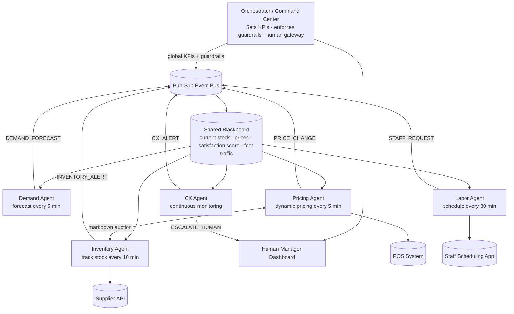

# Autonomous Retail Pop-Up Multi-Agent System

> MGSC 697 — Assignment 3 | Designing & Building Agentic AI Systems

---

## Table of Contents

1. [System Brief](#1-system-brief) · [Why MAS](#why-mas--why-a-single-agent-is-not-enough)
2. [Agent Roster](#2-agent-roster)
3. [Architecture Diagram](#3-architecture-diagram)
4. [Communication Contract](#4-communication-contract)
5. [Coordination Mechanism](#5-coordination-mechanism) · [Emergence](#emergent-behavior)
6. [Incentive Analysis](#6-incentive-analysis)
7. [Prototype / Simulation](#7-prototype--simulation)
8. [Evaluation Plan](#8-evaluation-plan)
9. [Safety & Governance Plan](#9-safety--governance-plan)
10. [MARL Bridge](#10-marl-bridge)
11. [Interoperability — A2A and MCP](#11-interoperability--a2a-and-mcp-boundaries)

---

## 1. System Brief

**Use case:** A time-limited retail pop-up store (3–8 hour event) that operates autonomously across demand forecasting, inventory management, dynamic pricing, labor scheduling, and customer experience — with a human manager as the final escalation layer.

**Stakeholders:**
- Pop-up organizer (revenue and brand outcomes)
- Shoppers (price fairness, experience quality)
- On-site staff (workload and scheduling)
- Suppliers (order fulfillment, lead times)

**Objective:** Maximize `(total_revenue × avg_satisfaction_score) / total_cost` within the pop-up window while maintaining a gross margin floor of 35% and a customer satisfaction floor of 4.0/5.0.

**Failure stakes:** Stockouts leave revenue on the table; overstocking wastes capital; bad dynamic pricing alienates customers and triggers social backlash; understaffing creates long queues; a runaway markdown cascade collapses margin.

### Why MAS — Why a Single Agent Is Not Enough

A single agent cannot run this pop-up because three fundamental constraints apply simultaneously:

**1. Parallel decisions at different frequencies**
Demand must be forecasted every 5 minutes, inventory checked every 10 minutes, and staffing reviewed every 30 minutes. A single agent processing these sequentially would either miss time-sensitive signals or create a bottleneck that delays every decision.

**2. Competing local objectives that cannot coexist in one reward function**
- Pricing wants to maximize margin → raise prices
- CX wants satisfied customers → keep prices fair
- Inventory wants zero waste → clear stock at any cost
- Labor wants minimum headcount → reduce staff

Combining these into one agent produces a reward function that is internally contradictory. A MAS allows each agent to optimize its local objective while a shared global reward and guardrails keep them aligned.

**3. Tool and permission boundaries**
Each agent needs access to fundamentally different external systems — the pricing agent writes to the POS, the labor agent reads the staff roster, the inventory agent calls the supplier API. Granting one agent unrestricted access to all systems is a security and governance risk. Role separation enforces least-privilege access.

---

## 2. Agent Roster

| Agent | Role | Tools | Memory | Permissions |
|---|---|---|---|---|
| **Demand Agent** | Forecast product demand every 5 min | Sales velocity API, foot traffic sensor, time-series model | Rolling 2-hr sales window | Read POS, read sensors |
| **Inventory Agent** | Track stock, trigger restocks/markdowns | POS system, inventory DB, supplier API | Current stock levels, reorder history | Read/write inventory, call supplier API |
| **Pricing Agent** | Dynamic pricing to maximize revenue | Competitor price API, POS write API | Price history, demand signals | Write prices to POS (within guardrails) |
| **Labor Agent** | Schedule staff to meet wait-time SLA | Staff scheduling app, task dispatch API | Shift roster, wait-time history | Read/write staff schedule |
| **CX Agent** | Monitor satisfaction scores, wait times, handle inquiries | Chatbot interface, queue monitor, satisfaction survey API | Interaction logs, complaint history | Read queue, send notifications, escalate |

---

## 3. Architecture Diagram



---

## 4. Communication Contract

### Message Schema

Every message on the event bus follows this envelope:

```json
{
  "schema_version": "v1",
  "trace_id": "tr_abc123",
  "message_id": "msg_001",
  "agent_id": "demand_agent",
  "msg_type": "DEMAND_FORECAST",
  "priority": "normal",
  "deadline_ms": 5000,
  "idempotency_key": "forecast_14:30:00",
  "payload": {}
}
```

### Message Types

| Type | Sender | Subscribers | Priority |
|---|---|---|---|
| `DEMAND_FORECAST` | Demand Agent | Pricing, Inventory, Labor | normal |
| `INVENTORY_ALERT` | Inventory Agent | Pricing, Orchestrator | high |
| `PRICE_CHANGE` | Pricing Agent | Inventory, CX, Orchestrator | normal |
| `MARKDOWN_BID` | Inventory Agent | Pricing Agent | high |
| `STAFF_REQUEST` | Labor Agent | Orchestrator | normal |
| `CX_ALERT` | CX Agent | Labor, Orchestrator | high |
| `ESCALATE_HUMAN` | CX Agent / Orchestrator | Human Manager | critical |

### Escalation Rules

- Any `priority: critical` message bypasses the bus and goes directly to the human dashboard
- Pricing changes > 25% require orchestrator approval before hitting POS
- Inventory orders above $300 require human confirmation

---

## 5. Coordination Mechanism

**Choice: Hybrid Supervisor + Market**

### Why not pure supervisor?

A pure hierarchy creates a bottleneck for the pricing-inventory negotiation, which has natural market dynamics. The orchestrator cannot optimally set markdown depth — the agents with local information (inventory urgency, current demand) can.

### Why not pure market?

Unconstrained market mechanisms between agents with misaligned local objectives (e.g., pricing maximizes margin, inventory wants to clear stock) risk emergent collusion or race-to-bottom pricing without guardrails.

### The hybrid design

- **Orchestrator layer:** Sets global KPIs, enforces hard guardrails (35% margin floor, 4.0/5.0 satisfaction floor), owns the human escalation path
- **Market layer (Pricing ↔ Inventory):** When stock is high and closing time approaches, Inventory Agent signals clearance urgency with a `MARKDOWN_BID`. Pricing Agent responds with a markdown offer. The market clears at the discount rate that satisfies both the margin floor and the clearance goal
- **Pub-sub for all other coordination:** Demand forecasts, CX alerts, and staff requests are broadcast events — any agent that needs them subscribes

### Emergent Behavior

Emergence occurs when local agent interactions produce global behavior that was not explicitly programmed.

**Expected (useful) emergence:**
- **End-of-event clearance cascade** — as closing time approaches, the inventory agent signals urgency → pricing agent marks down → demand increases → labor agent calls in surge staff → satisfaction improves → pop-up closes with minimal waste and strong final-hour revenue. No single agent orchestrates this; it emerges from local rules.
- **Demand-price equilibrium** — during a demand spike, pricing raises prices which slightly suppresses demand, which then signals pricing to stop surging. The system self-regulates without explicit coordination.

**Unwanted emergence:**
- **Death spiral** — demand drops → pricing marks down to stimulate sales → margin shrinks → labor cuts staff to save cost → wait times rise → satisfaction falls → demand drops further. Each agent acts rationally locally, but the system collapses globally. **Mitigation:** the 35% margin floor breaks the cycle before it starts; the wait-time SLA penalty prevents labor from cutting staff when CX is already degraded.
- **Price oscillation** — pricing agent surges price → demand drops → pricing reads low demand and stops surging → demand recovers → pricing surges again. Creates an unstable price loop. **Mitigation:** circuit breaker after 3 reversals in 10 minutes.

---

## 6. Incentive Analysis

### Local and Global Objectives

| Agent | Local Reward | Global Penalty |
|---|---|---|
| Demand | Minimize forecast MAPE | −3× if MAPE > 15% |
| Inventory | Minimize end-of-event waste | −5× if stockout occurs |
| Pricing | Maximize revenue per transaction | −10× if satisfaction drops below 4.0 |
| Labor | Minimize labor cost | −5× if wait time > 4 min |
| CX | Maximize avg satisfaction score | −5× if escalation rate > 10% |

**Global reward (shared):** `(total_revenue × avg_satisfaction_score) / total_cost`

> **Note on satisfaction score:** We use a 1–5 in-event satisfaction rating (collected via post-transaction survey) rather than traditional NPS (−100 to +100 scale), which requires a follow-up window incompatible with a same-day pop-up.

### Markdown Timing (Pricing Agent Policy)

As closing time approaches, the pricing agent follows a real-world clearance curve:

| Time before close | Markdown depth |
|---|---|
| 2 hours | 10–15% off |
| 1 hour | 20–30% off |
| 30 min | 30–50% off |
| Final 10 min | 50–70% off (cost recovery only) |

### Risks

| Risk | Mitigation |
|---|---|
| Pricing-inventory death spiral | Margin floor guardrail hardcoded at 35% |
| Labor cutting staff to save cost while CX degrades | Wait-time SLA penalty (> 4 min) outweighs labor savings |
| Demand agent over-forecasting to trigger restocks | MAPE penalty on forecast accuracy |
| Free-rider (agent taking global reward without contributing) | Per-agent Shapley value attribution at event close |

---

## 7. Prototype / Simulation

### How to run

```bash
pip install -r requirements.txt

# Text output — prints all agent messages and a final KPI summary
python simulation/run_simulation.py

# Visual dashboard — generates dashboard.html (open in any browser)
python simulation/dashboard.py
```

### What the simulation demonstrates

A 3-hour pop-up event with four scripted scenarios:

| Time | Scenario | Agents Involved |
|---|---|---|
| t = 0–60 min | Normal operation | All agents coordinating |
| t = 45 min | Demand spike (beverages +150%) | Demand → Pricing, Labor |
| t = 90 min | Best-seller stockout | Inventory → Pricing (substitute promotion) |
| t = 150 min | End-of-event clearance | Inventory ↔ Pricing markdown auction |

### Visual dashboard

`dashboard.py` runs the full simulation silently, captures a snapshot every 5 minutes, and writes a self-contained `dashboard.html` file with:

- **KPI cards** — Total Revenue, Gross Margin, Satisfaction Score, Global Reward, Human Alerts, Waste Value
- **4 Chart.js charts** — Cumulative revenue, Stock levels, Price evolution, Satisfaction & wait time (dual axis)
- **Scenario markers** — vertical dashed lines at t = 45, 90, and 150 min
- **Filterable message log** — all 50+ agent messages, filterable by type, with scenario badges

The dashboard represents the **Human Manager Dashboard** described in the architecture — the single pane of glass for the pop-up operator.

---

## 8. Evaluation Plan

### Agent-level metrics

| Agent | Metric | Target |
|---|---|---|
| Demand | MAPE | < 15% |
| Inventory | Stockout rate | < 5% of SKUs |
| Pricing | Revenue per transaction | > baseline +10% |
| Labor | Wait time | < 4 min average |
| CX | Avg satisfaction score | ≥ 4.0 / 5.0 |

### Interaction-level metrics

- Message delivery latency (p95 < deadline_ms)
- Auction clearance time for markdown bids (< 30 sec)
- Escalation rate to human (< 5% of events)

### System-level metrics

- Global reward: `(total_revenue × avg_satisfaction_score) / total_cost`
- Gini coefficient of reward distribution across agents (fairness)
- Shannon entropy of pricing actions (diversity of decisions)

### Human-level metrics

- Human override frequency
- Time-to-decision when escalated
- Manager satisfaction with dashboard clarity

---

## 9. Safety & Governance Plan

### Hard guardrails (cannot be overridden by agents)

- Pricing agent cannot set any price below cost (gross margin floor = 35%)
- Pricing agent cannot exceed 3× MSRP
- Inventory orders above $300 require human approval
- Any price change > 25% triggers orchestrator review

### Human-in-the-loop triggers

| Condition | Action |
|---|---|
| Satisfaction score drops below 3.5 | CX agent escalates to manager dashboard |
| Inventory order > $300 | Paused pending human confirmation |
| Price change > 25% | Flagged for orchestrator approval |
| Agent message queue backs up > 50 | Orchestrator alerts manager |

### Audit log

Every agent action is written to an immutable event log with:
`timestamp · agent_id · action_type · payload · outcome · trace_id`

### Rollback

- Pricing rollback: any price change can be reverted to previous value via manager dashboard within 60 seconds
- Staffing rollback: labor agent decisions are soft suggestions until confirmed by on-site staff lead
- Simulation-first policy: all coordination logic is validated in simulation before any production pop-up

### Failure / abuse cases

| Failure | Response |
|---|---|
| Pricing agent oscillation (price war with itself) | Circuit breaker after 3 reversals in 10 min |
| Demand agent stale data (sensor offline) | Fall back to last known forecast + alert |
| Inventory agent supplier API timeout | Hold current stock levels, alert manager |
| CX agent chatbot mishandling sensitive complaint | Immediate escalation to human staff |

---

## 10. MARL Bridge

**Is multi-agent RL appropriate here?**

Partially yes — but premature for a first deployment.

The pricing agent's decision problem maps cleanly to an MDP:
- **State:** current demand, inventory levels, time remaining, competitor prices
- **Action:** set price (continuous or discretized)
- **Reward:** revenue × avg_satisfaction_score contribution

However, for a pop-up (short, one-time event):
- There is no time to train online during the event
- Safe exploration is impossible in a live retail environment
- Governance requires predictable, auditable pricing decisions — not a learned policy

**Recommended path:**
1. **Now:** Rule-based pricing agent with hand-tuned policies
2. **After 3–5 pop-ups:** Train a pricing policy via **offline RL** on logged event data
3. **At scale:** Use **CTDE** (Centralized Training, Decentralized Execution) — train all agents jointly with global state, deploy each agent with only its local observations

MARL is earned here, not assumed.

---

## 11. Interoperability — A2A and MCP Boundaries

### MCP (Model Context Protocol) — within the system

Each agent exposes its capabilities as typed MCP tools. This enforces least-privilege access and makes tool boundaries inspectable:

| Agent | Exposes via MCP |
|---|---|
| Pricing Agent | `set_price(item_id, price)`, `get_current_prices()` |
| Inventory Agent | `get_stock(item_id)`, `request_restock(item_id, units)` |
| Labor Agent | `get_staff_count()`, `request_staff(count, reason)` |
| CX Agent | `get_satisfaction_score()`, `escalate(reason)` |
| Demand Agent | `get_forecast(product, horizon_min)` |

The orchestrator uses MCP to call agent tools when enforcing guardrails, rather than reading shared state directly. This keeps the orchestrator decoupled from agent internals.

### A2A (Agent-to-Agent) — at external boundaries

A2A applies where agents cross trust or system boundaries:

| Boundary | Why A2A matters |
|---|---|
| Inventory Agent → Supplier Portal | The supplier is an external system with its own auth, rate limits, and response schema. A2A task handoff (with context, task ID, retry semantics) is safer than a raw API call. |
| Labor Agent → Staff Scheduling App | The scheduling app may be a third-party SaaS (e.g., Deputy, When I Work). A2A handles async confirmation and partial responses. |
| Orchestrator → Human Manager | Human approval is modeled as an A2A task — the orchestrator sends a task request, waits for a human response, and handles timeout gracefully. |

### Why both matter here

MCP handles **intra-system** capability discovery and tool calls — agents finding and calling each other's functions safely. A2A handles **cross-boundary** work handoffs — where context, progress tracking, and retry semantics are needed because the other side is external, slow, or human.
